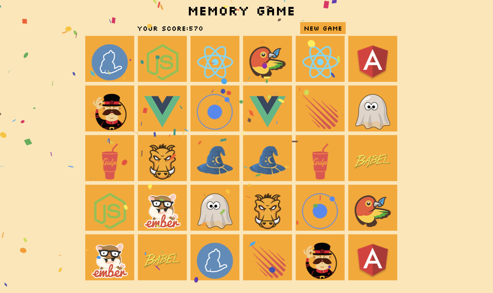

# Redux-Memory-Game

Live: https://cembicakci.github.io/redux-memory-game/





## Features
* score up and down
* match the same cards
* new game

## Tools
* React-Redux
* React-Confetti


## Usage

In the project directory, you can run:
```
npm start
```

